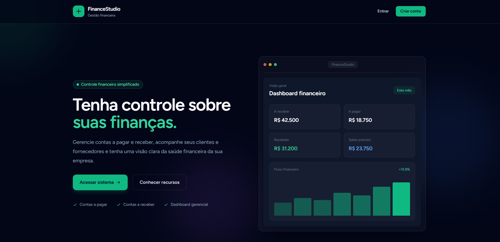

# FinanceStudio

Sistema web em Laravel + Vue/Inertia para controle simplificado de contas a pagar, contas a receber, pessoas/empresas e relatorios financeiros.



## Tecnologias

- Backend: PHP + Laravel
- Frontend: Vue 3 + Inertia.js
- Banco: MySQL no ambiente local do Laragon
- Autenticacao: Laravel Jetstream/Fortify
- Estilos: Tailwind CSS
- Graficos: Chart.js + vue-chartjs
- Icones: @lucide/vue
- Testes: PHPUnit/Pest via `php artisan test`

## Como executar

```bash
composer install
npm install
cp .env.example .env
php artisan key:generate
php artisan migrate --seed
npm run dev
php artisan serve
```

No Laragon, tambem da para acessar pelo host local configurado para o projeto.

Usuario criado pelo seeder:

- E-mail: `test@example.com`
- Senha: `password`

## Estrutura principal

```text
app/Models
  FinancialEntry.php       -> contas a receber e a pagar
  Person.php               -> pessoas/empresas cadastradas
  PersonType.php           -> tipos Cliente e Fornecedor

app/Support
  Format.php               -> formatacao/normalizacao compartilhada no backend

app/Http/Controllers
  DashboardController.php        -> dados da tela inicial
  PersonController.php           -> CRUD de Pessoas/Empresas
  FinancialEntryController.php   -> CRUD de Contas
  FinancialReportController.php  -> Relatorio financeiro

resources/js/Utils
  formatters.js            -> formatacao/normalizacao compartilhada no frontend
  money.js                 -> compatibilidade para imports antigos de money

resources/js/Composables
  useIncrementalList.js    -> carregamento incremental em blocos

resources/js/Pages
  Dashboard.vue                  -> tela inicial
  People/Index.vue               -> tela Pessoas/Empresas
  FinancialEntries/Index.vue     -> tela Contas
  Reports/Financial.vue          -> tela Relatorios

resources/js/Pages/*/Partials
  PersonForm.vue                 -> formulario do modal de Pessoas/Empresas
  FinancialEntryForm.vue         -> formulario do modal de Contas
```

## Banco de dados

### `person_types`

Guarda os tipos fixos de pessoa.

Campos principais:

- `id`
- `name`: Cliente ou Fornecedor
- `slug`: `customer` ou `supplier`

Criado por:

- `database/migrations/2026_08_13_170100_create_person_types_table.php`

### `people`

Guarda clientes e fornecedores do usuario autenticado.

Campos principais:

- `user_id`: usuario dono do cadastro
- `person_type_id`: FK para `person_types`
- `name`
- `document`: CPF/CNPJ somente com numeros
- `email`
- `phone`: telefone somente com numeros

Criado por:

- `database/migrations/2026_08_13_170101_create_people_table.php`

### `financial_entries`

Guarda contas a receber e contas a pagar em uma unica tabela.

Campos principais:

- `user_id`: usuario dono do lancamento
- `person_id`: cliente ou fornecedor vinculado
- `type`: `receivable` ou `payable`
- `description`
- `amount`
- `issue_date`
- `due_date`
- `status`: `pending`, `received`, `paid`, `overdue`, `cancelled`
- `settlement_date`: data de recebimento ou pagamento

Criado por:

- `database/migrations/2026_08_13_185428_create_financial_entries_table.php`

## Fluxo das paginas

### Autenticacao

Fluxo gerenciado pelo Jetstream/Fortify.

```text
Login -> rotas do Jetstream/Fortify -> tabela users -> area autenticada
Logout -> Jetstream/Fortify -> encerra sessao
```

As telas principais ficam protegidas pelo middleware:

```php
auth:sanctum
config('jetstream.auth_session')
verified
```

## Dashboard

Rota:

```text
GET /dashboard -> DashboardController::__invoke()
```

Fluxo:

```text
Usuario acessa Dashboard
-> routes/web.php chama DashboardController
-> DashboardController consulta people, person_types e financial_entries
-> monta props: people, metrics, cashFlow, upcomingBills
-> resources/js/Pages/Dashboard.vue renderiza cards e graficos
```

Arquivos envolvidos:

```text
app/Http/Controllers/DashboardController.php
resources/js/Pages/Dashboard.vue
resources/js/Components/Dashboard/SummaryMetricCard.vue
resources/js/Components/Dashboard/CashFlowChart.vue
resources/js/Components/Dashboard/FinancialRadarChart.vue
resources/js/Components/Dashboard/UpcomingBillsCard.vue
```

Dados exibidos hoje:

- Pessoas: clientes e fornecedores
- A receber: pendente, recebido e vencido
- A pagar: pendente, pago e vencido
- Saldo previsto e realizado
- Fluxo de caixa mensal com Chart.js
- Radar gerencial com metricas normalizadas
- Proximas contas pendentes/vencidas

Observacao sobre graficos:

- Os graficos usam Chart.js via `vue-chartjs`.
- O grafico de barras fica em `resources/js/Components/Dashboard/CashFlowChart.vue`.
- O grafico radar fica em `resources/js/Components/Dashboard/FinancialRadarChart.vue`.
- Os icones da interface usam `@lucide/vue`.

## Pessoas/Empresas

Rota principal:

```text
GET /pessoas-empresas -> PersonController::index()
```

Fluxo de listagem:

```text
Menu Pessoas/Empresas
-> routes/web.php chama PersonController::index
-> PersonController::peoplePage busca 20 cadastros do usuario logado
-> retorna props para resources/js/Pages/People/Index.vue
-> Vue filtra localmente por busca e Cliente/Fornecedor
```

Fluxo de carregar mais:

```text
Botao Carregar +20 cadastros
-> People/Index.vue usa useIncrementalList
-> GET /pessoas-empresas/dados
-> PersonController::data()
-> PersonController::peoplePage()
-> tabela people
-> Vue adiciona os novos registros na lista ja carregada
```

Fluxo de cadastro:

```text
Botao Novo cadastro
-> People/Index.vue abre Modal
-> PersonForm.vue preenche dados
-> submitPerson()
-> POST /pessoas-empresas
-> PersonController::store()
-> validatedData() normaliza CPF/CNPJ e telefone
-> Person::create()
-> tabela people
```

Fluxo de edicao:

```text
Botao Editar
-> People/Index.vue abre Modal com dados atuais
-> PersonForm.vue edita dados
-> submitPerson()
-> PUT /pessoas-empresas/{person}
-> PersonController::update()
-> authorizePerson() garante que pertence ao usuario logado
-> validatedData()
-> $person->update()
-> tabela people
```

Fluxo de exclusao:

```text
Botao Excluir
-> confirmacao no navegador
-> DELETE /pessoas-empresas/{person}
-> PersonController::destroy()
-> authorizePerson()
-> $person->delete()
-> tabela people
```

Validacoes principais:

- Nome obrigatorio
- CPF com 11 digitos ou CNPJ com 14 digitos
- CPF/CNPJ unico por usuario
- E-mail valido quando informado
- Telefone com 10 ou 11 digitos quando informado
- Tipo obrigatorio: Cliente ou Fornecedor

## Contas

Rota principal:

```text
GET /contas?type=receivable -> Contas a Receber
GET /contas?type=payable    -> Contas a Pagar
```

Controller:

```text
FinancialEntryController::index()
```

Fluxo de listagem:

```text
Menu Contas
-> routes/web.php chama FinancialEntryController::index
-> activeType() decide receivable ou payable
-> consulta tabela financial_entries do usuario logado
-> filtra no backend por descricao, pessoa e status
-> retorna entries, people, statuses, summary
-> resources/js/Pages/FinancialEntries/Index.vue renderiza a tela
```

Fluxo de cadastro:

```text
Botao Nova conta
-> FinancialEntries/Index.vue abre Modal
-> FinancialEntryForm.vue preenche dados
-> submitEntry()
-> POST /contas
-> FinancialEntryController::store()
-> validatedData()
-> FinancialEntry::create()
-> tabela financial_entries
```

Regra importante:

```text
Se type = receivable -> person_id precisa ser Cliente
Se type = payable    -> person_id precisa ser Fornecedor
```

Fluxo de edicao:

```text
Botao Editar
-> Modal com dados atuais
-> PUT /contas/{financialEntry}
-> FinancialEntryController::update()
-> authorizeEntry() garante usuario dono do registro
-> validatedData()
-> $financialEntry->update()
-> tabela financial_entries
```

Fluxo de exclusao:

```text
Botao Excluir
-> DELETE /contas/{financialEntry}
-> FinancialEntryController::destroy()
-> authorizeEntry()
-> $financialEntry->delete()
-> tabela financial_entries
```

Status por tipo:

```text
A receber: Pendente, Recebido, Vencido, Cancelado
A pagar:   Pendente, Pago, Vencido, Cancelado
```

## Relatorios

Rota principal:

```text
GET /relatorios -> FinancialReportController::__invoke()
```

Fluxo de abertura:

```text
Menu Relatorios
-> routes/web.php chama FinancialReportController
-> entryPage() busca 20 lancamentos do usuario logado
-> retorna filtros e opcoes para Reports/Financial.vue
-> Vue filtra localmente os dados carregados
```

Filtros locais no Vue:

- Periodo por vencimento
- Cliente ou Fornecedor
- A Receber ou A Pagar
- Status
- Busca por pessoa: nome, CPF ou CNPJ

Fluxo de carregar mais:

```text
Botao Carregar +20 contas
-> Reports/Financial.vue usa useIncrementalList
-> GET /relatorios/dados
-> FinancialReportController::entries()
-> entryPage()
-> tabela financial_entries com relacionamento person/personType
-> Vue adiciona os novos registros na lista carregada
```

Resumo do relatorio:

```text
Dados carregados no navegador
-> computed filteredEntries
-> computed summary
-> cards e tabela atualizam sem nova request
```

## Rotas principais

```text
GET    /dashboard                    dashboard
GET    /pessoas-empresas             people.index
GET    /pessoas-empresas/dados       people.data
POST   /pessoas-empresas             people.store
PUT    /pessoas-empresas/{person}    people.update
DELETE /pessoas-empresas/{person}    people.destroy
GET    /contas                       financial-entries.index
POST   /contas                       financial-entries.store
PUT    /contas/{financialEntry}      financial-entries.update
DELETE /contas/{financialEntry}      financial-entries.destroy
GET    /relatorios                   reports.index
GET    /relatorios/dados             reports.entries
```

## Padroes usados no projeto

### Dono do registro

As tabelas principais possuem `user_id` para evitar vazamento de dados entre usuarios.

```text
people.user_id
financial_entries.user_id
```

Nos controllers:

```text
PersonController::authorizePerson()
FinancialEntryController::authorizeEntry()
```

### Dados normalizados

CPF/CNPJ, telefone e valor sao normalizados antes de salvar.

Backend:

```text
app/Support/Format.php
```

Frontend:

```text
resources/js/Utils/formatters.js
```

### Filtros locais com carregamento incremental

Usado em:

```text
Pessoas/Empresas
Relatorios
```

Base compartilhada:

```text
resources/js/Composables/useIncrementalList.js
resources/js/Utils/formatters.js
```

Ideia:

```text
Carrega 20 registros iniciais
-> usuario filtra no Vue sem request
-> se precisar de mais dados, clica em Carregar +20
-> API busca mais 20 registros
```

## Testes

Rodar todos os testes:

```bash
php artisan test
```

Rodar testes especificos:

```bash
php artisan test tests/Feature/PeopleManagementTest.php
php artisan test tests/Feature/FinancialEntryManagementTest.php
php artisan test tests/Feature/FinancialReportTest.php
php artisan test tests/Feature/DashboardManagementTest.php
```

## Build do frontend

```bash
npm run build
```